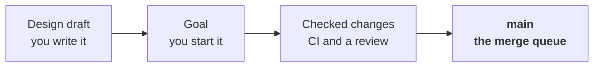

```mermaid
flowchart LR
  accTitle: How work reaches main
  draft["Design draft<br>you write it"] --> goal["Goal<br>you start it"]
  goal --> checked["Checked changes<br>CI and a review"]
  checked --> main["main<br>the merge queue"]:::strong
  classDef strong font-weight:bold
```
